<style type="text/css">
body {background:grey transparent;
}
</style>

## Overview 

1. What led me to this project ?  
2. Goals for this presentation
3. Problem Description
4. Data processing 
5. EDA
6. Feature Buildings
7. Model Buildings
8. Comparing models
9. Conclusion
10. References


--- 


## What led me to this project ?  

> - Wanted to apply Big data method on the humanitarian sector and create an analytic value around one current issue.
> - Found a rich dataset provided by [Driven Data](https://www.drivendata.org/competitions/7/pump-it-up-data-mining-the-water-table/page/23/) offering an open challenge until 2021 with data compiled from  http://taarifa.org/ website and the Tanzanian Ministry of Water.
> - Participate in an open - data challenge online.  
> - Build a data stand-alone project which responds to Project requirements and that makes first conclusions about predictions and highlights future improvements to be made to the scripts to improve model performance

--- 


## Goal of this presentation

> - Present major steps required for project requirement
> - Present you the framework I implemented to handle one online data challenge and receive advice if any to improve it ! 
> - I had a little more time to prepare this presentation. I have used the package [Slidify](https://github.com/ramnathv/slidify) which is a tool to create, customize and publish, reproducible HTML5 slide decks using R Markdown. 

> - You can follow this slide within your browser by clicking to this [link](https://13w13.github.io/Big-Data-Spring-2020-SGH-Pump-it-Up-Data-Mining-the-Water-Table/#1). I will ask you a small participation in a slide ! 


--- .segue .quote .dark
<q> "Water is at the <span class = 'red'> core of sustainable development</span> and is critical for socio-economic development, energy and food production, healthy ecosystems and for human survival itself" <cite>      UN Website - 2020 <cite> <q> 

<style>
.dark q {
  color: white;
}
</style>

--- 

## Problem Description

> - The original goal is to predict whether a **water pump** is **functional**, **functional but needs repairs** or **non functional** based on a train dataset. 

> - This is an **intermediate-level practice competition** which allow us to train us to predict the operating condition of a water-point for each record in a dataset.

> - A smart understanding of which water-points will fail can improve **maintenance operations** and ensure that **clean, potable water is available** to communities across Tanzania.


> - Faced to an **unsupervised classification problem**
> - The metric used for the competition is **classification rate** ( percentage of rows where the predicted class y in the submission matches the actual class y in the test set).

--- 

An example of a Water Pump - http://www.humanosphere.org/

![An example of a Water Pump - http://www.humanosphere.org/] (https://miro.medium.com/max/1200/0*BomKgCu3JWStGLm6.jpg)


--- .segue bg:grey

# I hope it is all clear from now. Let's dig it ! 

--- bg:#EEE

## Data processing 


- Get the data. 
  - Usually, a data challenge provides a train and test datasets with  test dataset target empty. Here the website, has separated train value and train labels ... 

```r
train_value <- read.csv("Trainingset_values.csv")
train_labels <-read.csv("Trainingset_label.csv")
test_values <- read.csv("Testset_value.csv")
```


  - We merge the train value and the train label ... 
  

```r
train <- merge(train_labels, train_value)
test <- test_values
```

---

- ... and plot the first 6 rows of our train dataset.  

<iframe src="./assets/widgets/dt.html" width=100% height=100% allowtransparency="true"> </iframe>

--- 

- The labels in this dataset are simple. There are three possible values:    
    
 Name           | Description
 -------------- | ------------
 functional      | the waterpoint is operational and there are no repairs needed
 functional needs repair          | the waterpoint is operational, but needs repairs 
 non functional        | the waterpoint is not operational
 
   
        
- Let us describe the number of each pumps in status group and their proportions : `Unbalanced dataset` ? 


             functional functional needs repair          non functional 
                  32259                    4317                   22824 

             functional functional needs repair          non functional 
             0.54308081              0.07267677              0.38424242 

> - Our dataset is pretty balanced but we can already notice that we have a great number of Missing values. We will see in future part how I managed it. First, let us do some EDA in order to better understand our data.


---

## Exploratory Data Analysis

- Create 2 bar plots for quantity
  
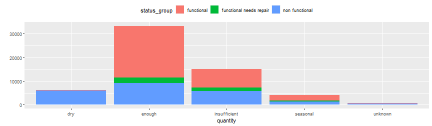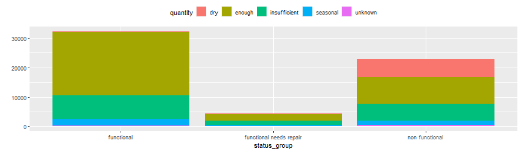

---

- Create bar plot for quality_group
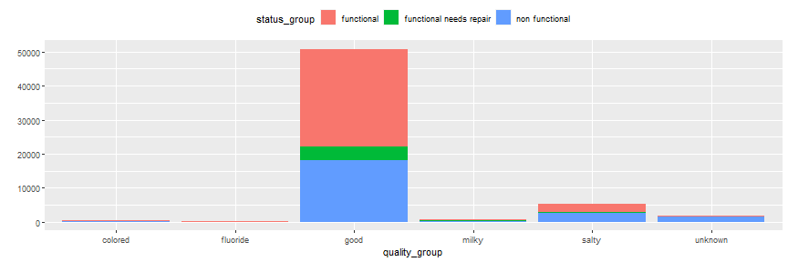
      
- Create bar plot for water point_type

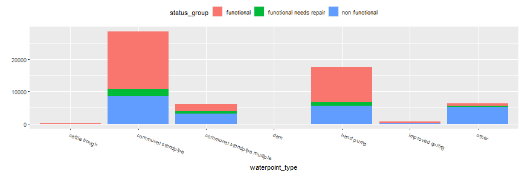

---

- Create histogram for all variables

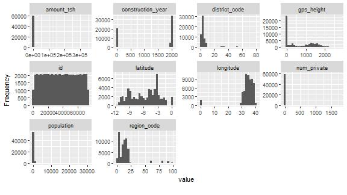
     
- Create a histogram for construction_year grouped by status_group

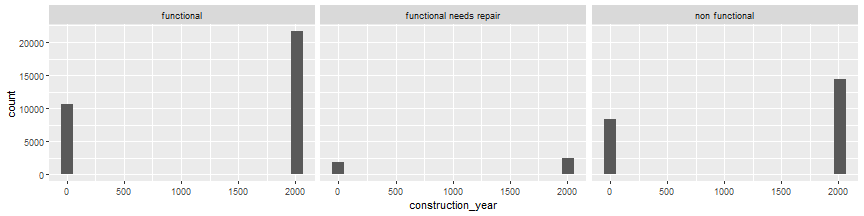

---

## Feature Buildings

> - Features building was maybe one of the most important part of my project. 

> - Very often in challenges, this part is a key part, allowing the models to really find performance. 
In order, we will address the following problems: 
**reducing factor levels**, **handle missing and empty values**. 

> - For feature engineering, it is better to combine training and the test sets together into **one dataset**. So I added a column subset in order to split the data later. 

```r
train$subset = "train"
test$subset = "test"
test$status_group<-""
data = rbind(train,test)
```

---
## Reducing factor levels


```r
names(data)
```
    
> - The data table contains an `ID column`, a **subset indicator**, **a response column** (status_group is functional, functional needs repair or non functional) and **38 features.**

> - Based on their names , we could conclude that some features have the same information but maybe at different levels (for example, extraction_type and extraction_type_group). 
 
> - For each grouping of features, we will keep both the coarser and the finer variables but **group some of the smaller levels** together so that categorical predictors have **minimum levels**. 

---

- First, we will reduce factor levels if the number of a factor is small and thus **irrelevant.**This code shows us in descending order of n the frequency of each **factor level** and then we have the proportion.


```r
data %>%
  group_by(extraction_type_class, extraction_type_group, extraction_type) %>% tally(sort=TRUE)
## # A tibble: 18 x 4
## # Groups:   extraction_type_class, extraction_type_group [13]
##    extraction_type_class extraction_type_group extraction_type               n
##    <fct>                 <fct>                 <fct>                     <int>
##  1 gravity               gravity               gravity                   33263
##  2 handpump              nira/tanira           nira/tanira               10205
##  3 other                 other                 other                      8102
##  4 submersible           submersible           submersible                5982
##  5 handpump              swn 80                swn 80                     4588
##  6 motorpump             mono                  mono                       3628
##  7 handpump              india mark ii         india mark ii              3029
##  8 handpump              afridev               afridev                    2208
##  9 submersible           submersible           ksb                        1790
## 10 rope pump             rope pump             other - rope pump           572
## 11 handpump              other handpump        other - swn 81              284
## 12 wind-powered          wind-powered          windmill                    152
## 13 handpump              india mark iii        india mark iii              135
## 14 motorpump             other motorpump       cemo                        108
## 15 handpump              other handpump        other - play pump           101
## 16 handpump              other handpump        walimi                       60
## 17 motorpump             other motorpump       climax                       41
## 18 handpump              other handpump        other - mkulima/shinyanga     2
```
--- 


```r
prop.table((table(data$extraction_type_class)))
## 
##      gravity     handpump    motorpump        other    rope pump  submersible 
##  0.447986532  0.277602694  0.050868687  0.109117845  0.007703704  0.104673401 
## wind-powered 
##  0.002047138
```


We decide to class the small level to "other", meaning rope pump, wind-powered to other. 


```r
data$extraction_type_class[data$extraction_type_class=="rope pump"] <- "other"
data$extraction_type_class[data$extraction_type_class=="wind-powered"] <- "other"
```

--- 
We will remove middle level extraction_type_group and combine some of the smaller levels. 

```r
data = data %>%mutate(extraction_type = revalue(extraction_type,
	                                 c("cemo" = "other motorpump",
	                                   "climax" = "other motorpump",
	                                   "other - mkulima/shinyanga" = "other handpump",
	                                   "other - play pump" = "other handpump",
	                                   "walimi" = "other handpump",
	                                   "other - swn 81" = "swn",
	                                   "swn 80" = "swn",
	                                   "india mark ii" = "india mark",
	                                   "india mark iii" = "india mark"))) %>%select( - extraction_type_group ) 
```


> - I have done the same process for following variables : **"quality_group"**, **remove waterpoint_type_group.**, **payment_type**, **Scheme_name**, **recorded by**, **ward variable and wpt-name**, **subvillage**, **lga**. 


---


## Remove Missing value

- One difficulty in our dataset is that there is no **clear missing values** but only zeros. However, for some variables, it seems that having 0 in observation is not possible and can be seen as a missing value :  
funder, installer, gps_height, population, construction_year, and possibly, amount_tsh, latitude and longitude (given to the fact that Tanzania geographical position).   We should **re-code** those variable to NA. 

```r
data = data %>%
  mutate(gps_height = ifelse(gps_height == 0, NA, gps_height)) %>%
  mutate(population = ifelse(population == 0, NA, population)) %>%
  mutate(amount_tsh = ifelse(amount_tsh == 0, NA, amount_tsh)) %>%
  mutate(longitude = ifelse(longitude == 0, NA, longitude)) %>%
  mutate(latitude = ifelse(latitude == 0, NA, latitude)) %>%
  mutate(construction_year = ifelse(construction_year == 0, NA, construction_year))
```

---


> - Let us plot **missing values distribution**. 
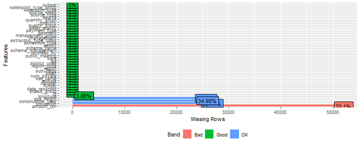
> - We can observe that amount_tsh has a lot of NA and this variable is not very clear for the reader. We should **remove it.** 

```r
data = data %>% select( - amount_tsh)
```

> - Then we have population and gps_height variables with more than 30 % of NA. Since these last variables contain important information, we should **keep them**. 

> - Since we will use Random Forest models, we have to **re-code NA values to zeros**. 

```r
data[is.na(data)] <- 0
```

---

 We still have **empty rows** that we should resolve.

```r
data$permit<- as.character(data$permit)
data$permit[data$permit==""]<-"unknown"
data$permit<-as.factor(data$permit)
data$scheme_management<- as.character(data$scheme_management)
data$scheme_management[data$scheme_management==""]<-"unknown"
data$scheme_management<-as.factor(data$scheme_management)
data$public_meeting<- as.character(data$public_meeting)
data$public_meeting[data$public_meeting==""]<-"unknown"
data$public_meeting<-as.factor(data$public_meeting)
```

> - This ends our feature **feature building part**. I tried to take time for this part in our presentation as it important in data competition and in order to share methods. 

> - We are now ready to build our models ! 

---

## Building models

First, we should **unsplit** data to build our **final dataset** and clean our environment for a peaceful mind. 

```r
trainset<-data[data$subset=="train",]
testset<-data[data$subset=="test",]
trainset<-trainset[-28]
testset<-testset[-28]
```


```r
rm(train)
rm(test)
rm(test_values)
rm(train_labels)
rm(train_value)
```
When I applied my first models, it should be noted that I faced a factor and subseting problem. I found a solution by applying **str** and **drop levels** to our unsplit datasets.  

```r
str(data$status_group)
str(trainset$status_group)
str(trainset$status_group)

table(data$status_group)
table(trainset$status_group)
table(trainset$status_group)

trainset$status_group<-droplevels(trainset$status_group)
table(trainset$status_group)
```

---
## Tree 1 : Random Forest

> - Random Forest reduces the variance of forecasts in a decision tree alone, thus improving performance. It does this by combining n decision trees in a **bagging approach**. We don't prune the tree. Each tree in the random forest is trained on a **random subset** of data. The predictions are then averaged.


> - I have build model on the **train** dataset with following parameters : 

> - randomForest(status_group~.,data=trainset, ntree=300, do.trace=T)

---

> - This graph comes from our first model and plot the importance of variable in our model. 
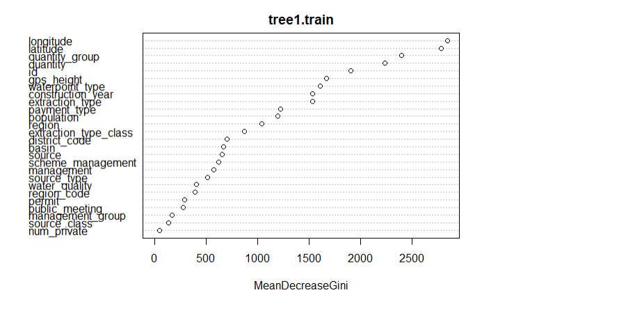

---

> - The second graph shows the evolution of error compared to the number of trees. 


---

- We can apply our models on our testset and create our first submission file.

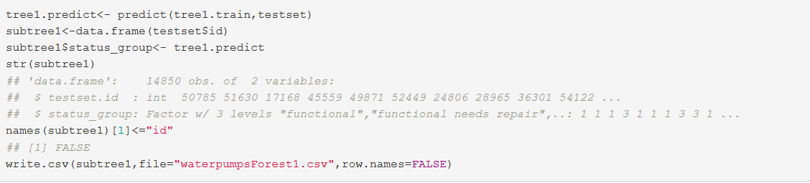


> - We will see in our last part what were the results.

> - In order to compare the models, we will build another Tree. 

---

## Tree 2 : Boosted Tree

> - Here we will use Boosted Tree aka XGBoost. XGBoost is a well-known and efficient open source implementation of the improved gradient tree algorithm.

> - We are building a tree and looks which value is predicted poorly and assign to it higher weigh in our prediction.

> - Let us build and predict our model with 1000 maximum number of boosting iterations with following parameters : 
> xgboost::xgboost(data=data.matrix(trainset[,-2]),label=trainset[,2],nrounds=1000,params=list(booster="gbtree", eta=0.10, max_depth = 3, subsample = 0.50, colsample_bytree=0.50))

---

- Let's apply our model and create a second submission file.

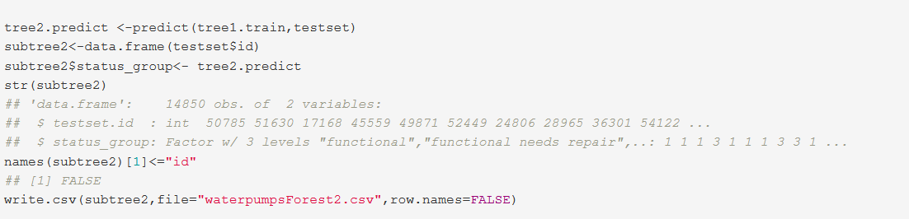

---

## Upload results and Comparing models

I upload first submission of Random Forest to the [Driven Data Platform](https://www.drivendata.org/competitions/7/pump-it-up-data-mining-the-water-table/page/23/)

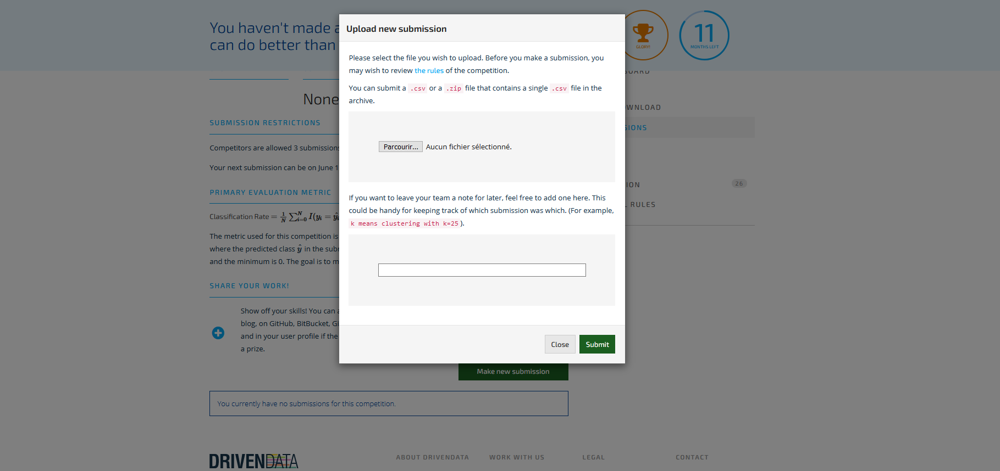

---

- For recall, Primary Evaluation Metric is Classification Rate
$$
\frac{1}{N} \sum_{i=0}^N I(y_i = \hat{y_i})
$$
It calculates the percentage of rows where the predicted class y^ in the submission matches the actual class, y in the test set. The maximum is 1 and the minimum is 0. The goal is to maximize the classification rate.   

> - Before we see finally our results, a quick quiz ! 

--- &radio

## Quiz : Random Forest performance

In your opinion, according to this presentation, what is the rank x of our first model out of the 9000 registered on the platform to date? 

1. _1<x<1000_
2. 1000<x<3000
3. 3000<x<9000


*** .hint
Our model didn't do so bad ! 

*** .explanation
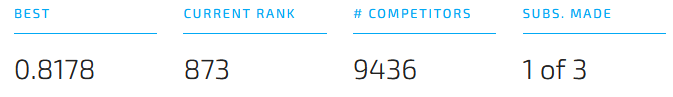


--- &radio

## Quiz : Boosted Tree performance

In your opinion, according to this presentation, has Boosted Tree better results ? 

1. _Yes_
2. No


*** .hint
Random Forest had 300 iteration when Boosted Tree had 1000 maximum number of boosting iteration.  

*** .explanation
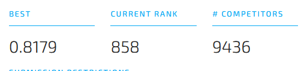

---

## Conclusion

> -Our second tree returned a better metric with **0.8179**. This small increase has moved us up **15 places** in the competition.

> -So **Boosted Tree** was the best Tree model to predict whether a water pump is functional, functional but needs repairs or non functional.

> -I decided to stop here as the 2 models gave almost the same results meaning that one should move again to **feature building** (any recommendation or ideas is welcome) so as to **maximize Classification Rate**.

> -**Thank you for your attention** !
 

---

## References

- Dr Jaroslaw Jozef Olejniczak- Big Data - SGH Spring 2020   
- Community of Driven Data https://community.drivendata.org/c/pump-it-up-data-mining-the-water-table
- Stack Overflow community

---
## Questions ? 

<br />
<center>

</center>

     
<font size="2">photo from  [http://www.bookcovercafe.com/independent-publishing-q-and-a-series-01/](http://www.bookcovercafe.com/independent-publishing-q-and-a-series-01/)</font>
